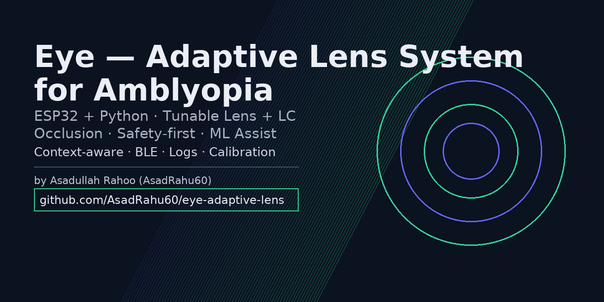
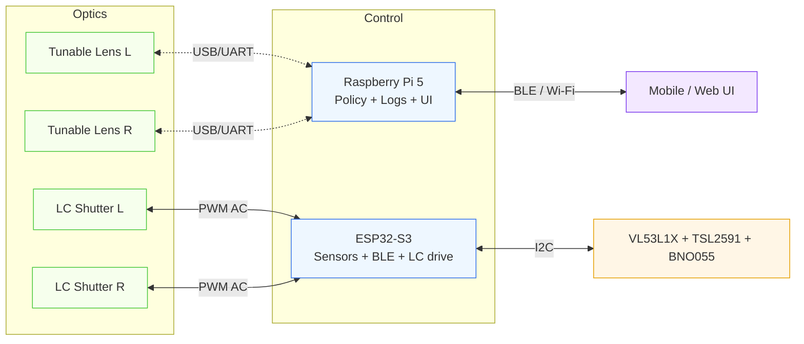

<p align="center">
  
</p>

# Eye — Adaptive Lens System for Amblyopia (R&D Prototype)

> **Disclaimer:** Research/education prototype. **Not a medical device.** Do not use for self-treatment.

[](LICENSE)
[](https://github.com/AsadRahu60/eye-adaptive-lens/actions)
[](https://github.com/psf/black)
[](https://www.espressif.com/en/products/socs/esp32-s3)
[](CONTRIBUTING.md)

Electronically tunable **per-eye focus** + **LC shutter occlusion** for supervised amblyopia research tasks. Sensor-aware modes (near/desk/outdoor), **manual + automated therapy profiles**, and **QA-first** documentation (URS → SRS → RTM → Tests).

---

## Table of Contents
- [Why](#why)
- [Architecture](#architecture)
- [Quality & Testing](#quality--testing)
- [Quick Start](#quick-start)
- [Project Layout](#project-layout)
- [Roadmap](#roadmap)
- [Hiring Manager Highlights](#hiring-manager-highlights)
- [Contributing](#contributing)
- [License](#license)

---

## Why
I grew up with amblyopia and want a treatment path that’s adaptive, comfortable, and measurable—so patients actually stick with it.**Amblyopia focus.** Amblyopia is a binocular imbalance—reduced acuity and suppression in one eye—that’s often treated with static occlusion (patching), which can be hard to personalize and sustain. **Eye** provides a **programmable, supervised research instrument** to deliver **graded per-eye stimuli** (diopter ramps and LC occlusion) with strict safety guardrails and full telemetry. This supports experiments on **binocular balance**, comfort envelopes, and adherence—generating clean, reproducible logs for clinician-led protocols. *(R&D only — not a medical device.)*
 
This repo is a research prototype to test whether safe, gradual per-eye focus changes plus transparent occlusion can improve adherence and outcomes, where as the traditional patching is static and hard to personalize. **Eye** explores dynamic, clinician-configurable training: subtle per-eye focus changes + intermittent occlusion, driven by context and fully logged.

### MVP Goals
- Per-eye focus control (Optotune/Varioptic) with smooth ramps
- Per-eye LC occlusion (AC drive, no DC bias)
- Sensors (ToF, ALS, IMU) → context (near/desk/outdoor)
- BLE UI (manual sliders + profiles) and data logging

---

## Architecture


**Stack:** ESP32‑S3 (Arduino), Python 3 host, BLE GATT, I²C sensors, H‑bridge for LC shutters, Optotune/Varioptic lens drivers, optional Flutter app.

---

## Vision Therapy Simulator (Computer Vision)

To enable rapid experimentation when physical tunable lens hardware is unavailable,
this project includes a **computer-vision-based simulation module** located at:

➡️ `vision_therapy_cv/`

This module simulates key therapy concepts such as **per-eye occlusion, blur, and
contrast modulation** using a live camera or video input. It follows the same
system-level principles as the hardware path: **safety bounds, staged control,
telemetry, and reproducible logging**.

### Why this module exists
- Hardware lenses are expensive and not always available during early research
- Software simulation allows faster iteration and validation
- Enables test automation, data analysis, and ML experimentation
- Keeps the project moving while preserving architectural intent

### What it supports (current stage)
- JSON-based therapy profiles (occlusion cycles, blur, contrast)
- Left / right / binocular visual simulation
- Conservative safety limits on all effects
- Session-level CSV logging for validation and analysis

This module is **not a replacement** for the optical system.  
It is a **research and validation tool** that complements the ESP32-based hardware
pipeline and supports the long-term roadmap toward adaptive, closed-loop therapy.

➡️ See detailed usage and implementation:
[vision_therapy_cv/README.md](vision_therapy_cv/README.md)

---

---

## Quality & Testing
Standards‑inspired (ISO 14971 risk thinking, IEC 62304/62366 mindset) — **not certified**.
- **Levels:** unit (Python), integration (sensors/driver links), system (bench), usability (operator workflows)
- **Types:** functional, performance (latency/accuracy), reliability (repeatability), safety (slew limits, watchdog), data integrity
- **Gates:** entry/exit criteria per sprint; mandatory logs attached to PRs
- **CI:** lint (black, flake8), markdown lint, Arduino lint — see `.github/workflows/ci.yml`

Docs: [`docs/URS.md`](docs/URS.md) · [`docs/SRS.md`](docs/SRS.md) · [`docs/RTM.md`](docs/RTM.md) · [`docs/TEST_STRATEGY.md`](docs/TEST_STRATEGY.md) · [`docs/TEST_CASES.md`](docs/TEST_CASES.md) · [`docs/SAFETY_PROTOCOLS.md`](docs/SAFETY_PROTOCOLS.md)

---

**Optional ML module:** `host/pi/ml/` trains a logistic model on session data
to suggest small therapy adjustments. Safety clamps (duty/diopter) always
override ML outputs. See `docs/ML_OVERVIEW.md`.

---
## Quick Start
### Firmware (ESP32‑S3)
1. Install Arduino IDE + ESP32 core.
2. Wire LC shutter via DRV8833; sensors to I²C.
3. Flash `firmware/esp32/main.cpp`; check serial output.

+## 🔎 For Supervisors/Admissions — Start Here
+1. **Architecture:** `docs/ARCHITECTURE.md`
+2. **Roadmap (S1–S6):** `docs/ROADMAP.md` with exit criteria
+3. **Safety & Risk:** `docs/SAFETY_PROTOCOLS.md`, `docs/RISK_REGISTER.md`
+4. **Testing approach:** `docs/TEST_STRATEGY.md`, `docs/TEST_CASES.md`
+5. **ML overview (optional):** `docs/ML_OVERVIEW.md` (guardrailed, CI-safe)
+6. **Proposal (short):** `docs/PROPOSAL_SHORT.pdf` — 2 pages

+## Machine Learning (optional assist)
+The **ML module** in `host/pi/ml/` trains a small logistic model on session data to **suggest**
+therapy adjustments (e.g., occlusion duty). **Hard safety clamps** (duty/diopter) always override
+ML outputs; a rule-based fallback is used if the model is absent or confidence is low.
+See `docs/ML_OVERVIEW.md` and `docs/DATA_PRIVACY.md`.
+
+### ML quick demo (synthetic, CI-safe)
+```bash
+python host/pi/ml/make_synthetic.py
+python host/pi/ml/train.py
+pytest -q
+```

### Host (Pi/PC)
python3 -m venv .venv && source .venv/bin/activate
pip install -r requirements.txt -r requirements-dev.txt
python host/pi/lens_controller.py   # update serial ports and driver commands

---

## Project Layout
```markdown
.
├─ firmware/esp32/               # BLE + sensors + LC shutters
├─ host/pi/                      # Lens driver control + policy + logs
│  └─ ml/                        # Safe ML assist (training + inference)
├─ apps/flutter_mobile/          # future BLE app
├─ calibration/
├─ tests/                        # pytest tests (incl. test_ml.py)
├─ docs/                         # URS, SRS, RTM, Roadmap, Safety, ML, etc.
├─ data/sessions/                # sample CSV logs (kept anon)
├─ models/                       # saved model artifacts (joblib)
├─ .github/workflows/ci.yml
├─ README.md  CONTRIBUTING.md  CODE_OF_CONDUCT.md
└─ LICENSE  CHANGELOG.md  .gitignore

```

---

## Roadmap
- **S1:** LC shutters + sensors + BLE telemetry (bench)
- **S2:** One tunable lens + calibration; Python control
- **S3:** Dual‑eye integration; context policy; logging
- **S4:** Therapy modes; safety guards; reports
- **S5:** Wearable rig; comfort tuning; power mgmt
- **S6:** Optional eye tracking; analytics

Full details: [`docs/ROADMAP.md`](docs/ROADMAP.md)

---

## Hiring Manager Highlights
- **Traceability:** URS → SRS → RTM → Test cases (audit‑ready thinking)
- **Safety mindset:** slew‑rate limiter, bounds, watchdog, session caps
- **Process:** CI with lint/tests; issue/PR templates; Conventional Commits
- **Systems thinking:** optics + embedded + host + data pipeline

---

## Contributing
See [`CONTRIBUTING.md`](CONTRIBUTING.md). Use **Conventional Commits** and PR template. Attach test logs (scope screenshots for LC drive, diopter ramps) when relevant.

---

## License
MIT — see [`LICENSE`](LICENSE).

---

### GitHub Polish Checklist
- Repo topics: `amblyopia`, `tunable-lens`, `embedded`, `esp32`, `python`, `vision-science`, `qa-testing`
- Social preview: upload `assets/social-preview.png` (1200×630)
- Pin this repo; add it to CV/LinkedIn
- CI badge already points to `https://github.com/AsadRahu60/eye-adaptive-lens/actions`
